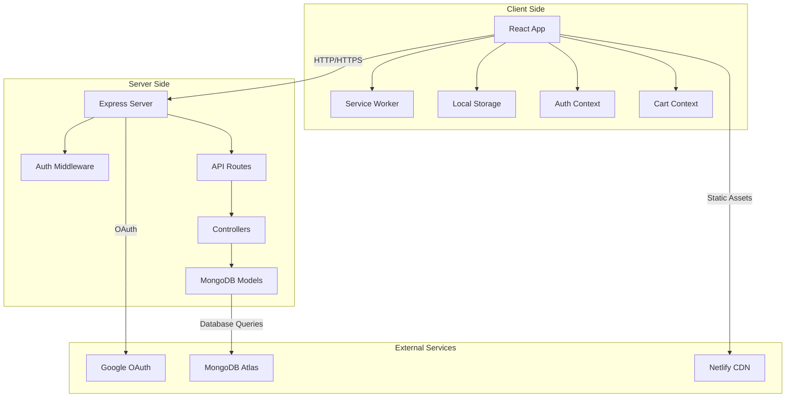
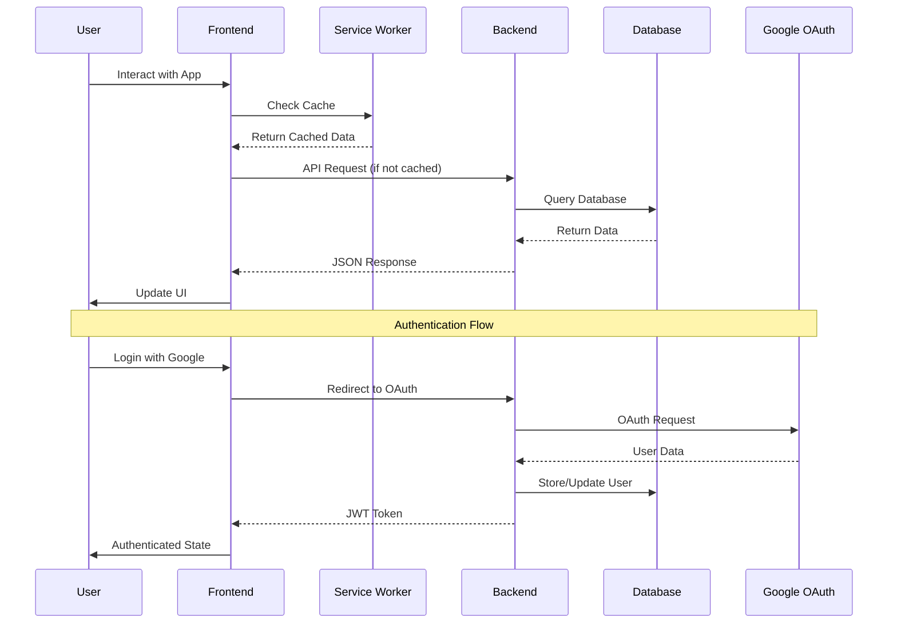
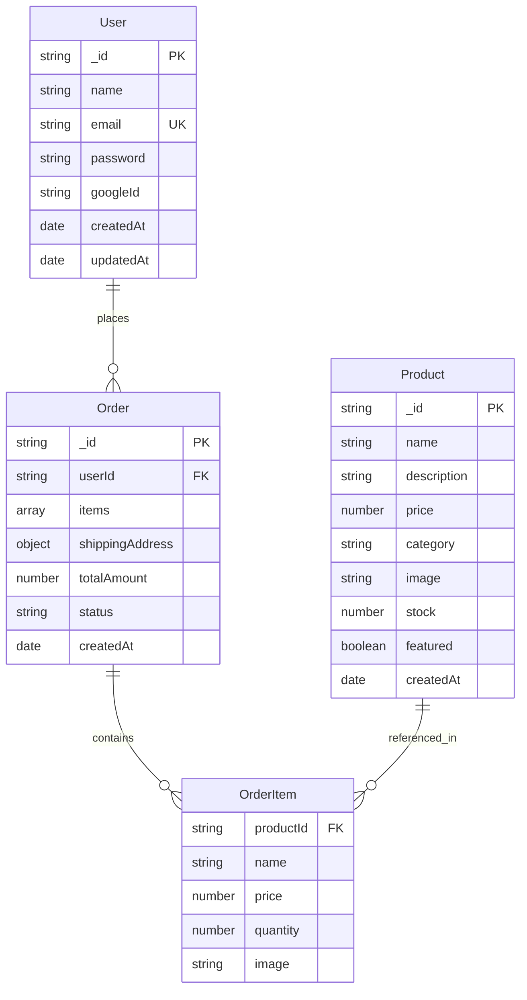
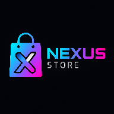

# Hyper Store: Full-Stack E-commerce PWA

<div align="center">


[](https://reactjs.org/)
[](https://nodejs.org/)
[](https://www.mongodb.com/)
[](https://web.dev/progressive-web-apps/)
[](LICENSE)
[](https://app.netlify.com/)

*A modern, full-stack e-commerce Progressive Web Application with futuristic design and cutting-edge features*

[🚀 Live Demo](https://hyperstore-demo.netlify.app) • [📖 Documentation](#documentation) • [🐛 Report Bug](https://github.com/username/hyper-store/issues) • [✨ Request Feature](https://github.com/username/hyper-store/issues)

</div>

---

## 📋 Table of Contents

- [🌟 Overview](#-overview)
- [✨ Key Features](#-key-features)
- [🎯 Demo & Screenshots](#-demo--screenshots)
- [🛠️ Technology Stack](#️-technology-stack)
- [🏗️ System Architecture](#️-system-architecture)
- [📋 Prerequisites](#-prerequisites)
- [🚀 Installation Guide](#-installation-guide)
- [📁 Project Structure](#-project-structure)
- [🔐 Authentication System](#-authentication-system)
- [🛒 Shopping Cart Implementation](#-shopping-cart-implementation)
- [📱 Progressive Web App Features](#-progressive-web-app-features)
- [🔌 API Documentation](#-api-documentation)
- [🎨 UI/UX Design System](#-uiux-design-system)
- [🔒 Security Implementation](#-security-implementation)
- [🚀 Deployment Guide](#-deployment-guide)
- [🧪 Testing](#-testing)
- [🔧 Troubleshooting](#-troubleshooting)
- [📊 Performance Optimization](#-performance-optimization)
- [🔮 Roadmap](#-roadmap)
- [🤝 Contributing](#-contributing)
- [📄 License](#-license)
- [👨‍💻 Author](#-author)

---

## 🌟 Overview

Hyper Store is a cutting-edge, full-stack e-commerce Progressive Web Application that combines modern web technologies with a futuristic design aesthetic. Built with scalability and user experience in mind, it offers a complete shopping platform with advanced features like offline capabilities, social authentication, and real-time notifications.

### 🎯 Project Goals

- **User Experience**: Deliver a seamless, app-like shopping experience
- **Performance**: Achieve fast loading times and smooth interactions
- **Accessibility**: Ensure the platform is usable by everyone
- **Scalability**: Build with future growth and feature additions in mind
- **Modern Standards**: Implement latest web development best practices

### 🏆 What Makes It Special

- **PWA Implementation**: Full offline functionality with service workers
- **Dual Authentication**: Both local and OAuth 2.0 social login
- **Real-time Features**: Live cart updates and instant notifications
- **Responsive Design**: Seamless experience across all devices
- **Cyber-tech Aesthetic**: Unique futuristic design that stands out

---

## ✨ Key Features

### 🛍️ Core E-commerce Features
- **Product Catalog**: Browse products with advanced search and filtering
- **Shopping Cart**: Add, remove, and modify cart items with persistence
- **Checkout Process**: Streamlined order placement with validation
- **Order Management**: View order history and track status
- **User Profiles**: Manage personal information and preferences

### 🔐 Authentication & Security
- **Local Authentication**: Secure email/password registration and login
- **Google OAuth 2.0**: One-click social login integration
- **JWT Tokens**: Stateless authentication with secure token management
- **Password Security**: bcrypt hashing for password protection
- **Session Management**: Automatic token refresh and logout

### 📱 Progressive Web App
- **Installable**: Add to home screen on any device
- **Offline Support**: App shell works without internet connection
- **Push Notifications**: Real-time updates and promotions
- **Background Sync**: Sync data when connection is restored
- **App-like Experience**: Native feel with web technologies

### 🎨 Modern UI/UX
- **Futuristic Design**: Cyber-tech aesthetic with dark theme
- **Responsive Layout**: Mobile-first design approach
- **Smooth Animations**: Micro-interactions and transitions
- **Accessibility**: WCAG compliant with keyboard navigation
- **Toast Notifications**: Real-time user feedback

### ⚡ Performance Features
- **Fast Loading**: Vite build tool for optimal performance
- **Code Splitting**: Lazy loading for better initial load times
- **Image Optimization**: Responsive images with modern formats
- **Caching Strategy**: Smart caching for static and dynamic content
- **Bundle Optimization**: Tree shaking and minification

---

## 🎯 Demo & Screenshots

### 🌐 Live Demo
Visit the live application: [https://hyperstore-demo.netlify.app](https://hyperstore-demo.netlify.app)

### 📸 Screenshots

<details>
<summary>Click to view screenshots</summary>

#### Home Page


#### Product Catalog


#### Shopping Cart


#### User Profile


#### Mobile View


</details>

### 🎥 Video Demo
[](https://youtube.com/watch?v=demo)

---

## 🛠️ Technology Stack

### Frontend Technologies

| Technology | Version | Purpose | Documentation |
|------------|---------|---------|---------------|
| **React** | 18.3.1 | UI Framework | [React Docs](https://reactjs.org/docs) |
| **Vite** | Latest | Build Tool | [Vite Guide](https://vitejs.dev/guide/) |
| **React Router** | 6.30.1 | Client Routing | [Router Docs](https://reactrouter.com/) |
| **Lucide React** | Latest | Icon Library | [Lucide Icons](https://lucide.dev/) |
| **React Hot Toast** | Latest | Notifications | [Toast Docs](https://react-hot-toast.com/) |

### Backend Technologies

| Technology | Version | Purpose | Documentation |
|------------|---------|---------|---------------|
| **Node.js** | 14+ | Runtime | [Node.js Docs](https://nodejs.org/docs) |
| **Express** | Latest | Web Framework | [Express Guide](https://expressjs.com/) |
| **MongoDB** | Atlas | Database | [MongoDB Docs](https://docs.mongodb.com/) |
| **Mongoose** | Latest | ODM | [Mongoose Docs](https://mongoosejs.com/) |
| **Passport.js** | Latest | Authentication | [Passport Docs](http://www.passportjs.org/) |
| **JWT** | Latest | Tokens | [JWT.io](https://jwt.io/) |

### Development Tools

- **ESLint**: Code linting and formatting
- **Prettier**: Code formatting
- **Git**: Version control
- **VS Code**: Recommended IDE
- **Postman**: API testing
- **Chrome DevTools**: Debugging and performance

### Deployment & Hosting

- **Netlify**: Frontend hosting with CI/CD
- **Heroku**: Backend hosting and deployment
- **MongoDB Atlas**: Cloud database hosting
- **Cloudinary**: Image storage and optimization

---

## 🏗️ System Architecture

### 🔄 Architecture Overview



### 📊 Data Flow Diagram



### 🗄️ Database Schema



---

## 📋 Prerequisites

### System Requirements

| Component | Minimum | Recommended |
|-----------|---------|-------------|
| **Node.js** | 14.0.0 | 18.0.0+ |
| **npm** | 6.0.0 | 8.0.0+ |
| **RAM** | 4GB | 8GB+ |
| **Storage** | 2GB | 5GB+ |

### Required Accounts & Services

1. **MongoDB Atlas**
   - Create account at [mongodb.com](https://www.mongodb.com/cloud/atlas)
   - Set up a free cluster
   - Configure network access and database user

2. **Google Cloud Console**
   - Create project at [console.cloud.google.com](https://console.cloud.google.com)
   - Enable Google+ API
   - Create OAuth 2.0 credentials

3. **Git & GitHub** (for deployment)
   - GitHub account for version control
   - Git installed locally

### Development Tools

```bash
# Check Node.js version
node --version

# Check npm version
npm --version

# Install recommended global packages
npm install -g nodemon concurrently
```

---

## 🚀 Installation Guide

### 📥 Quick Start (5 minutes)

```bash
# Clone the repository
git clone https://github.com/username/hyper-store.git
cd hyper-store

# Install all dependencies (both frontend and backend)
npm run install-all

# Set up environment variables
npm run setup-env

# Start both servers
npm run dev
```# Nexus Store 🚀

A modern, futuristic e-commerce Progressive Web App (PWA) built with React and Node.js. Experience the future of online shopping with cutting-edge design and seamless functionality.



## ✨ Features

### 🛍️ Core Shopping Experience
- **Product Catalog**: Browse a curated selection of futuristic products
- **Smart Search**: Search products by name with real-time filtering
- **Shopping Cart**: Persistent cart that saves across sessions
- **Secure Checkout**: Complete order processing with shipping management
- **Order History**: Track your purchases and order status

### 🔐 Authentication
- **Dual Login System**: Email/password and Google OAuth 2.0
- **User Profiles**: Manage personal information and shipping addresses
- **Protected Routes**: Secure access to checkout and profile pages
- **JWT Security**: Token-based authentication for API security

### 📱 Progressive Web App
- **Installable**: Add to home screen on mobile and desktop
- **Offline Ready**: Core functionality works without internet
- **Fast Loading**: Optimized caching strategies
- **App-like Experience**: Native feel with modern web technologies

### 🎨 Modern Design
- **Futuristic Theme**: Cutting-edge visual design
- **Responsive Layout**: Perfect on all devices
- **Smooth Animations**: Engaging user interactions
- **Dark Mode Ready**: Modern aesthetic with glassmorphism effects

## 🛠️ Technology Stack

### Frontend
- **React 18.2** - Modern UI library with hooks
- **Vite** - Next-generation frontend tooling
- **React Router 6.30** - Client-side routing
- **Context API** - State management for auth and cart
- **Lucide React** - Beautiful icon system
- **React Hot Toast** - User-friendly notifications
- **Custom CSS** - Styled with modern design principles

### Backend
- **Node.js** - JavaScript runtime
- **Express** - Web application framework
- **MongoDB** - NoSQL database
- **Mongoose** - Object Document Mapper
- **JWT** - JSON Web Tokens for authentication
- **Passport.js** - Authentication middleware
- **bcrypt** - Password hashing
- **CORS** - Cross-origin resource sharing

### PWA Features
- **Service Worker** - Offline functionality and caching
- **Web App Manifest** - Installation and app metadata
- **Cache-First Strategy** - Optimized loading performance

## 🚀 Quick Start

### Prerequisites
- Node.js (v16 or higher)
- MongoDB database
- Google OAuth credentials (optional)

### Installation

1. **Clone the repository**
```bash
git clone https://github.com/yourusername/nexus-store.git
cd nexus-store
```

2. **Install dependencies**
```bash
# Install frontend dependencies
npm install

# Install backend dependencies (if separate)
cd backend && npm install
```

3. **Environment Setup**

Create `.env` file in the root directory:
```env
VITE_API_BASE_URL=http://localhost:5000/api
```

For backend (if separate), create `.env`:
```env
MONGODB_URI=mongodb://localhost:27017/nexus-store
JWT_SECRET=your-jwt-secret-key
GOOGLE_CLIENT_ID=your-google-client-id
GOOGLE_CLIENT_SECRET=your-google-client-secret
CLIENT_URL=http://localhost:5173
```

4. **Start the development servers**
```bash
# Start frontend
npm run dev

# Start backend (if separate)
cd backend && npm start
```

Visit `http://localhost:5173` to see the application.

## 📁 Project Structure

```
nexus-store/
├── public/
│   ├── icons/              # PWA icons
│   ├── manifest.json       # Web app manifest
│   └── sw.js              # Service worker
├── src/
│   ├── components/        # Reusable React components
│   │   ├── BottomNav.jsx
│   │   ├── Header.jsx
│   │   ├── LoadingSpinner.jsx
│   │   ├── ProductCard.jsx
│   │   └── SearchBar.jsx
│   ├── pages/             # Page components
│   │   ├── Home.jsx
│   │   ├── ProductList.jsx
│   │   ├── ProductDetail.jsx
│   │   ├── Cart.jsx
│   │   ├── Checkout.jsx
│   │   ├── Login.jsx
│   │   ├── Register.jsx
│   │   ├── Profile.jsx
│   │   └── AuthSuccess.jsx
│   ├── utils/             # Utilities and contexts
│   │   ├── api.js         # API service layer
│   │   ├── AuthContext.jsx # Authentication state
│   │   └── CartContext.jsx # Shopping cart state
│   ├── styles/            # CSS files
│   ├── App.jsx            # Main app component
│   └── main.jsx           # Entry point
├── package.json
└── README.md
```

## 🔌 API Endpoints

### Authentication
- `POST /api/auth/register` - Create new account
- `POST /api/auth/login` - User login
- `GET /api/auth/me` - Get current user
- `GET /api/auth/google` - Google OAuth login

### Products
- `GET /api/products` - Get all products
- `GET /api/products/:id` - Get single product
- `POST /api/products` - Create product (Admin)
- `PUT /api/products/:id` - Update product (Admin)
- `DELETE /api/products/:id` - Delete product (Admin)

### Orders
- `POST /api/orders` - Create new order
- `GET /api/orders/my-orders` - Get user orders
- `GET /api/orders/:id` - Get single order

### Users
- `GET /api/users/profile` - Get user profile
- `PUT /api/users/profile` - Update user profile

## 💾 Data Models

### User
```javascript
{
  name: String,
  email: String,
  password: String (hashed),
  role: String (user/admin),
  address: {
    street: String,
    city: String,
    state: String,
    zipCode: String,
    country: String
  },
  googleId: String (optional)
}
```

### Product
```javascript
{
  name: String,
  description: String,
  price: Number,
  image: String,
  category: String,
  stock: Number,
  inStock: Boolean,
  features: [String]
}
```

### Order
```javascript
{
  user: ObjectId,
  items: [{
    product: ObjectId,
    quantity: Number,
    price: Number
  }],
  total: Number,
  status: String,
  shippingAddress: Object,
  createdAt: Date
}
```

## 🎯 Key Features Explained

### Progressive Web App
The application implements full PWA capabilities:
- **Service Worker**: Caches static assets and provides offline functionality
- **Web App Manifest**: Enables installation on devices
- **Responsive Design**: Works perfectly on all screen sizes

### State Management
- **AuthContext**: Manages user authentication state globally
- **CartContext**: Handles shopping cart operations with localStorage persistence
- **React Router**: Provides seamless navigation without page reloads

### Security
- **JWT Authentication**: Secure token-based authentication
- **Protected Routes**: Conditional access based on authentication status
- **Password Hashing**: bcrypt for secure password storage
- **CORS Configuration**: Proper cross-origin request handling

## 🚀 Deployment

### Frontend (Netlify/Vercel)
1. Build the project: `npm run build`
2. Deploy the `dist` folder
3. Set environment variable: `VITE_API_BASE_URL`

### Backend (Heroku/Railway)
1. Set up MongoDB database
2. Configure environment variables
3. Deploy Node.js application

### Environment Variables
```env
# Frontend
VITE_API_BASE_URL=https://your-api-domain.com/api

# Backend
MONGODB_URI=mongodb+srv://...
JWT_SECRET=your-secret-key
GOOGLE_CLIENT_ID=your-google-client-id
GOOGLE_CLIENT_SECRET=your-google-client-secret
CLIENT_URL=https://your-frontend-domain.com
```

## 🧪 Testing

```bash
# Run tests
npm test

# Run linting
npm run lint

# Build for production
npm run build
```

## 🤝 Contributing

1. Fork the repository
2. Create a feature branch: `git checkout -b feature/amazing-feature`
3. Commit your changes: `git commit -m 'Add amazing feature'`
4. Push to the branch: `git push origin feature/amazing-feature`
5. Open a Pull Request

## 📄 License

This project is licensed under the MIT License - see the [LICENSE](LICENSE) file for details.

## 🙏 Acknowledgments

- **React Team** - For the amazing framework
- **Vite Team** - For blazing fast build tools
- **Lucide** - For beautiful icons
- **MongoDB** - For flexible database solutions

## 📞 Support

For support, email kishan@nexusstore.com or join our Slack channel.

---

**Made with ❤️ by Kishan**

*Experience the future of e-commerce with Nexus Store*
